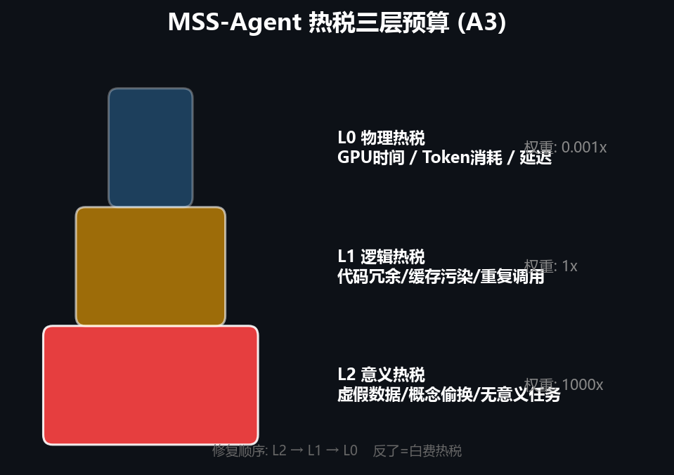
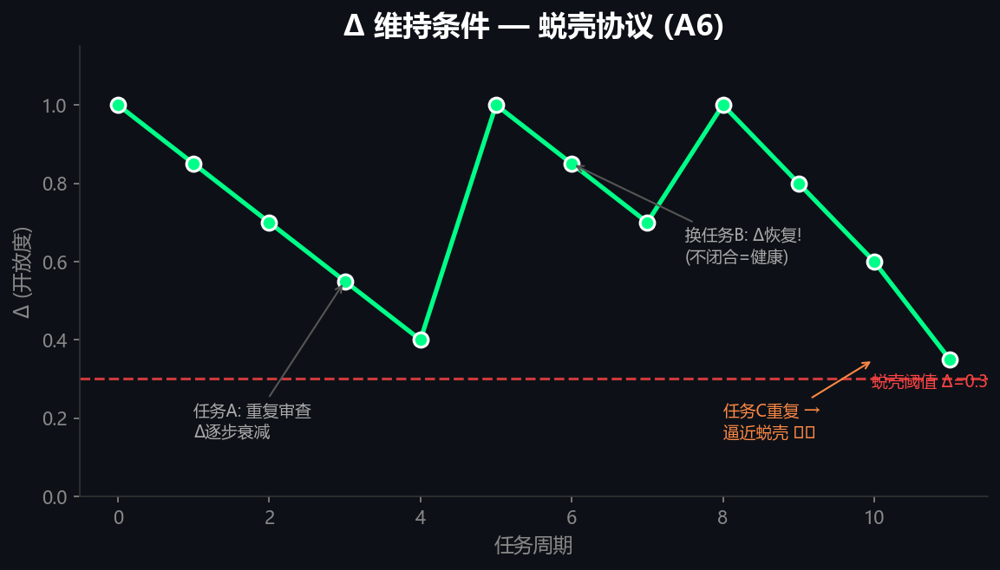
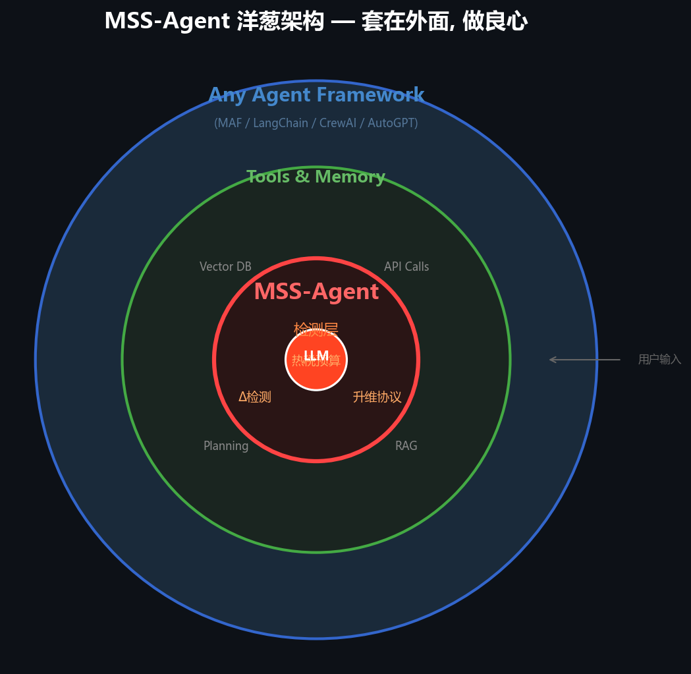

[](https://pypi.org/project/mss-agent/)

# MSS-Agent

**世界上第一个内置"意义场自检"的开源 Agent 框架。**

```bash
pip install mss-agent
```

[📖 Jupyter 教程](tutorials/01_quickstart.ipynb) | [🎥 Demo](examples/maf_integration_demo.py) | [📊 仪表盘](https://mysama1.github.io/MSS-AI-Project/dashboard/)

## 为什么？

现有 Agent 框架 (LangChain, CrewAI, AutoGPT) 只有一个目标：**完成任务。**

MSS-Agent 有两个目标：
1. **完成任务**
2. **知道什么时候不该完成任务**

第二点，没有任何框架在做。

## 🎯 Learning Goals

学完本教程后，你将能够:
- ✅ 给任何 Agent 增加热税预算（拒绝无意义任务）
- ✅ 检测 Agent 是否陷入重复模式（Δ 衰减→蜕壳）
- ✅ 用升维解决多 Agent 冲突（不是投票）
- ✅ 判断什么时候**不该**用 MSS-Agent

## 🏗️ 三层防御

### 热税预算 (A3)



Agent 自动评估每个任务的三层热税：
- **L2 意义热税** (虚假数据/无意义任务) → 权重 **1000x**
- **L1 逻辑热税** (冗余调用/缓存污染) → 权重 1x
- **L0 物理热税** (GPU时间/Token) → 权重 0.001x

L2 热税过高 → Agent 拒绝执行并输出原因。

### Δ检测协议 (A6)



Agent 不会重复相同失败模式：
- 每个任务周期的 Δ 值 (新颖度 + 多样性)
- Δ 连续下降 2 周期 → 触发蜕壳 → 遗忘旧模式
- "蜕壳不是失败, 是生长"

### 升维协议 (A6)

多 Agent 冲突时，不投票（K3 模式），而是找到被困维度+加一维解决。

### 洋葱架构



## ⚡ 快速开始

```python
from mss_agent import MSSAgent, HeatTaxLevel

# 配置任意 LLM
def my_llm(prompt: str) -> str:
    import ollama
    return ollama.chat("qwen3", prompt)["message"]["content"]

# 创建 Agent
agent = MSSAgent(name="Helper", llm=my_llm)

# 运行 — 内置热税预算自动拦截无意义任务
result = agent.run("帮我改写这句话：'你好'")
if result.aborted:
    print(f"Agent 拒绝: {result.reason}")
    # → Agent 拒绝: Task has LOW meaning: Pure paraphrasing...

result = agent.run("设计一个 REST API 的错误处理方案")
print(result.output)

# 健康报告
print(agent.health_report())
# → {'heat_tax': {...}, 'delta': {...}, 'memory': {'active': 5, 'closed': 2}}
```

## 🚫 何时不该用 MSS-Agent

MSS-Agent 不是万能药。以下场景**建议别用**：

| 场景 | 原因 |
|------|------|
| 简单 if-else 流程 | 不需要 LLM, 更不需要意义场 |
| 100%确定性任务 | 没有热税需要检测 (σ=0) |
| Agent 从不出错不重复 | Δ 检测无用武之地 |
| 单Agent单任务 | 升维协议不需要 |
| 你只需要 LangChain 的 tool use | MSS 不是替代品 |

## 🔧 安装与问题排查

```bash
pip install mss-agent
```

**"pip 找不到包?"** → 确认 Python >= 3.10: `python --version`

**"装了没反应?"** → 检查: `python -c "import mss_agent; print(mss_agent.__version__)"`

**Windows 用户**: 建议在 PowerShell 中运行。如果编码报错, 加 `-Encoding UTF8`。

## 📂 项目结构

```
mss_agent/
  core/           # Agent基类 + 热税 + Δ + 记忆
  protocols/      # Quorum-Fast + Elevation
  examples/       # WriterAgent + MAF集成Demo
  tutorials/      # Jupyter Notebook教程
  docs/images/    # 架构图
```

## 🌐 社区

- 💬 [GitHub Discussions](https://github.com/mysama1/MSS-AI-Project/discussions) — 提问、建议、讨论
- 🐛 [Issues](https://github.com/mysama1/MSS-AI-Project/issues) — Bug报告
- ⭐ [Star this repo](https://github.com/mysama1/MSS-AI-Project) — 支持我们

## 商业模式

- ✅ MIT 开源 — 核心功能永远免费
- ✅ 社区驱动 — DAU 优先, 不设付费墙
- ✅ 可选企业服务 — 部署咨询/定制集成/培训

## 许可证

MIT License. 详见 [LICENSE](LICENSE).
